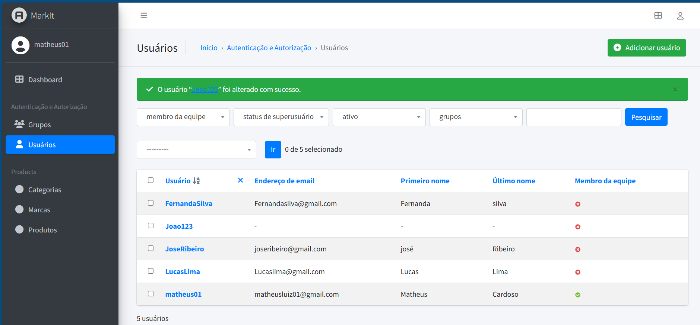

# Sistema_Gerenciamento_Django-Admin

Sistema de gerenciamento completo, com autenticação de usuários, controle de permissões, gestão de produtos, clientes e vendas. O sistema foi desenvolvido utilizando Django_admin e db.sqlite3 . Projeto simples 

## Funcionalidades

- Cadastro de produtos
- Cadastro de clientes
- Cadastro de Grupos
- Cadastro de vendas
- Controle de estoque
- Relatórios

## Tecnologias utilizadas

- Django
- python
- db.sqlite3

## Instalação

1. Clone o repositório
2. Instale as dependências: `pip install -r requirements.txt`
3. Execute as migrações: `python manage.py migrate`
4. Crie um superusuário: `python manage.py createsuperuser`
5. Inicie o servidor: `python manage.py runserver`

## Acesso ao Admin

Acesse o painel administrativo em [http://localhost:8000/admin](http://localhost:8000/admin) com o usuário criado.

